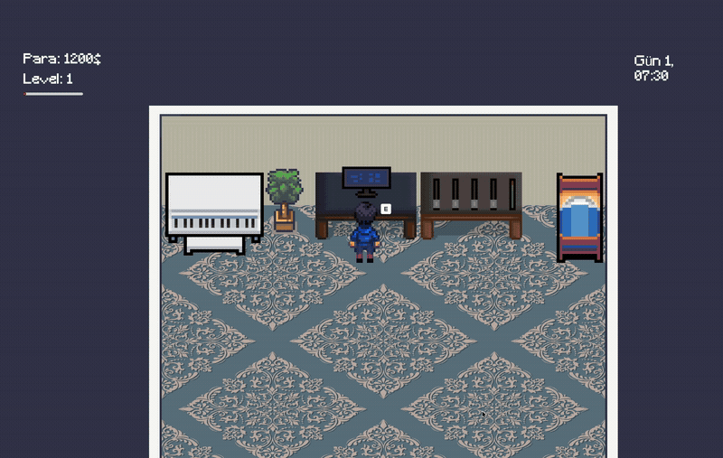
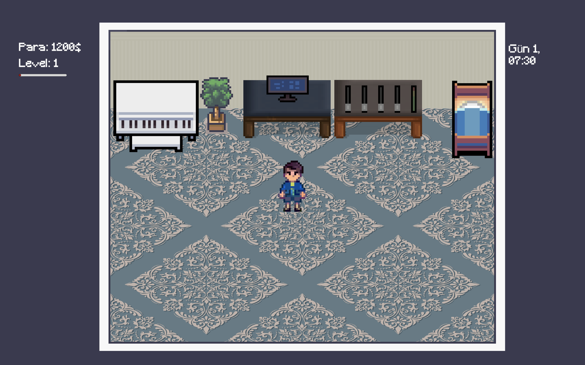
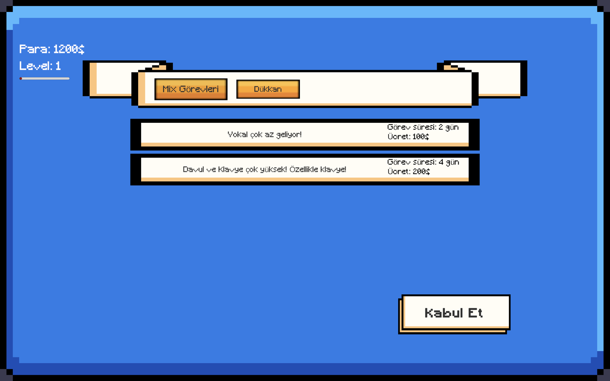
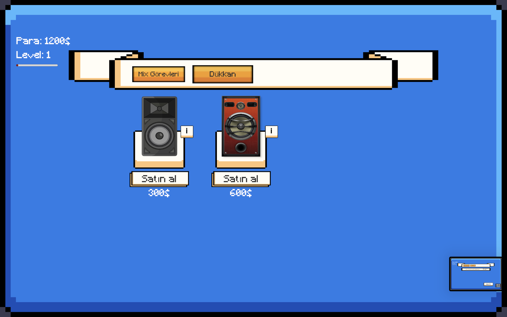
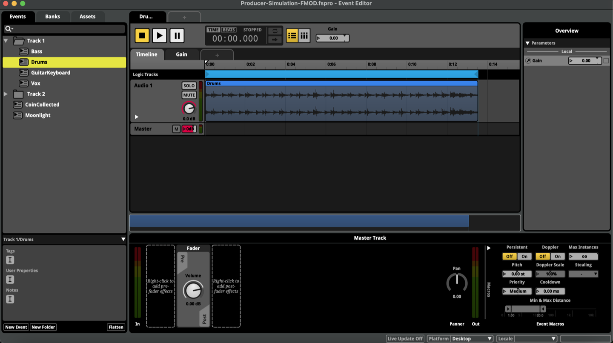
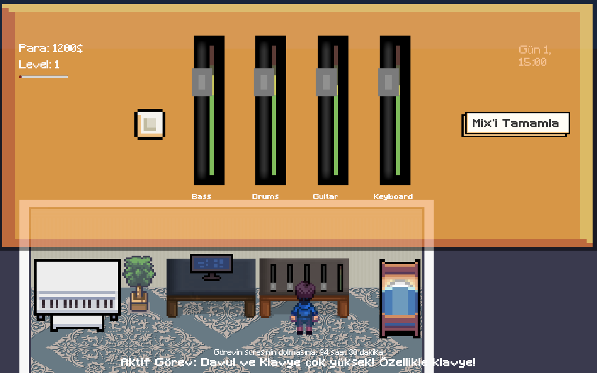

# Mixing Engineer Simulation

**Serbest çalışan bir mix mühendisinin hayatını anlatan 2D pixel-art simülasyon oyunu, gerçekten mix yapan bir konsolla.**

[](https://unity.com/)
[](https://www.fmod.com/)
[](Assets/Scripts)
[](https://unity.com/srp/universal-render-pipeline)
[](https://github.com/iberberoglu/MixingEngineerSimulation/releases/latest)

📄 **[English README →](README.md)**

Ekrandaki dört fader, FMOD event instance'larının gerçek `Gain` parametrelerini sürüyor; seviye
göstergeleri ise FMOD'un DSP metering API'sinden canlı peak değerleri okuyor. Ses tarafı mixlemenin
taklidi değil. Oyunun puanlamasına bağlı, çalışan bir mix.

▶ **[Oynanabilir macOS sürümünü indir](https://github.com/iberberoglu/MixingEngineerSimulation/releases/latest)** (evrensel binary, Unity veya FMOD Studio gerekmiyor)



*Konsolda bir iş: fader'lar FMOD event instance'larının `Gain` parametrelerini sürüyor, metreler de
peak seviyeleri doğrudan FMOD'un DSP metering'inden okuyor.*

---

## Proje hakkında

Bu projeyi 2025'te **İstanbul Teknik Üniversitesi, Müzik Teknolojisi** bölümündeki *Serbest Proje
Çalışması 3* dersi için yaptım. Danışmanım Dr. Ozan Sarıer'di, Ocak 2025'te teslim ettim.

Geldiğim yer ses tarafı, oyun değil. Bu projeden önce C++ ve JUCE ile
[bir RMS compressor plug-in'i](https://github.com/iberberoglu/RmsCompressor) yazmıştım; müzik
teknolojisini etkileşimli bir şeyin *içine* koyan bir proje yapmak istedim. Bu
yüzden Unity ve C#'ı sıfırdan öğrendim, ses motoru olarak da FMOD'u seçtim; çünkü fikrin ihtiyaç
duyduğu şey kanal bazında DAW seviyesinde kontroldü.

**Kurgu:** yeni mezun olmuş, parası ve referansı olmayan bir mix mühendisisin. İşler stüdyodaki
bilgisayara düşüyor (*"Vokal çok az geliyor!"*), sen de konsola oturup dört fader'ı müşterinin
istediği aralığa getiriyor ve teslim ediyorsun. İsabet para ediyor: XP de para da ne kadar
yaklaştığınla ölçekleniyor. Kazandığın parayla daha iyi monitör alıyorsun, iyi monitörler de hedef
aralıkları ekranda görünür kılıyor. Yani yükselttiğin şey doğrudan *daha iyi duymak*.

---

## Ekran görüntüleri

| Stüdyo | Bilgisayardaki iş ilanları | Dükkân: monitör yükseltmeleri |
|---|---|---|
|  |  |  |

---

## İşin ilginç kısmı: mixer gerçek

Bu oyunu yapmanın kolay yolu numaradan yapmaktı: sahte slider'lar ve senaryolanmış bir "puan". Sesin
gerçekten tepki vermesini istedim, çünkü zaten bir şey bildiğim kısım orasıydı.

### Fader'lar → FMOD parametresi

Her kanalı kendi FMOD event instance'ı olarak kurdum (`event:/Track 1/Bass`, `/Drums`,
`/GuitarKeyboard`, `/Vox`); her birinde master track'te volume'ü otomasyonlayan bir `Gain`
parametresi var. [`MixerControl.cs`](Assets/Scripts/MixerControl.cs), slider'ın 0–100 aralığını
−80…+10 dB'ye eşleyip doğrudan FMOD'a yolluyor:

```csharp
float normalizedValue = Mathf.Clamp01(value / 100f);
float volume = Mathf.Lerp(-80f, 10f, normalizedValue);   // dB
track.setParameterByName("Gain", volume);
```



*FMOD Studio projesi: dört kanallı iki şarkı, piyano ve arayüz event'leri. Her birinde oyunun çalışma
anında sürdüğü `Gain` parametresi var.*

### Metreler → FMOD DSP metering

[`MeteringDisplay.cs`](Assets/Scripts/MeteringDisplay.cs) her event instance'tan channel group'a
iniyor, baştaki DSP'yi alıyor, üzerinde metering'i açıyor ve her karede peak seviyeyi okuyor:

```csharp
track.getChannelGroup(out channelGroup);
channelGroup.getDSP(0, out dsp);
dsp.setMeteringEnabled(true, true);
// ...
dsp.getMeteringInfo(out _, out meteringInfo);
float db = 20f * Mathf.Log10(Mathf.Max(meteringInfo.peaklevel[0], 0.0001f));
```

Kare başına ham peak değerleri okunamayacak kadar zıplıyor; bu yüzden değeri, pixel-art metre
sprite'larından birine yuvarlamadan önce **10 karelik hareketli ortalamadan** geçiriyorum. Okunabilir
bir metre ile stroboskop arasındaki fark tam olarak bu yumuşatma.



*Her kanal şeridinde bir fader ve kendi metresi var. Yeşil barlar animasyon değil, FMOD'dan gelen
canlı peak seviyeleri.*

### Neden Unity'nin ses sistemi değil de FMOD

Projenin döndüğü karar bu. Unity'nin `AudioSource` ve `AudioMixer` yapısı sesi gayet iyi çalıyor ama
görünür bir mix konsolunun ihtiyaç duyduğu şekilde kanal başına çıkış seviyesi vermiyor. FMOD
veriyor; üstelik ses tarafının tamamını kod içinde kurmak yerine gerçek bir mixer ağacı, bus'lar ve
parametrelerle, tıpkı bir DAW oturumu gibi hazırlamama izin verdi.

---

## Oyun döngüsü

```
   ┌──────────────────────────────────────────────────────────────┐
   │                                                              │
   │   Bilgisayara git (E)  →  İş seç  →  Kabul et                │
   │                                  ↓                           │
   │        MixerControl.setSong()  →  4 FMOD stem'i yüklenir     │
   │                                  ↓                           │
   │        Fader'ları ayarla  →  setParameterByName("Gain")      │
   │                                  ↓                           │
   │        Mix'i Tamamla  →  kanal bazlı puanlama  →  XP + para  │
   │                                  ↓                           │
   │        Dükkân  →  monitör al  →  tolerans bantları açılır    │
   │                                  ↓                           │
   │        Yatakta uyu (E)  →  +8 saat  →  yeni gün, yeni iş     │
   │                                  ↓                           │
   └──────────────────────────────────────────────────────────────┘
```

Oyun içi saat **gerçek zamanda saniyede 10 oyun dakikası** hızında akıyor, 1. günün 06:00'ında
başlıyor. İşlerin gün cinsinden teslim süresi var; acele etmek istersen uyuyarak zamanı 8 saat
ileri alabiliyorsun.

---

## Puanlama

Teslim, işin belirlediği ideal fader konumlarına göre kanal kanal değerlendiriliyor
([`MixTasksManager.cs`](Assets/Scripts/MixTasksManager.cs)):

```
her 4 kanal için:
    mesafe = |fader − ideal|

    mesafe > tolerans      →  görev ANINDA başarısız
    mesafe < tolerans / 4  →  faktör = 1.0        (tam isabet)
    aksi halde             →  faktör = 1 − (mesafe / tolerans)

çarpan = (kritik kanalların ortalaması × 0.7)
       + (diğerlerinin ortalaması      × 0.3)

XP ve para bu çarpanla ölçekleniyor
```

Her iş hangi kanalların *kritik* olduğunu işaretliyor, yani müşterinin asıl şikâyet ettiklerini.
Böylece vokali düzeltmek, bası bozmamaktan çok daha fazla puan ediyor. Seviye eğrisi basit bir
karesel formül: sonraki seviye için gereken XP = `seviye² × 100`.

Oyunla gelen içerik, iki şarkı üzerinde iki iş:

| İş | Şarkı | Süre | Ödül | Tolerans | Kritik kanallar |
|---|---|---|---|---|---|
| *"Vokal çok az geliyor!"* | Track 1: Bass / Drums / Guitar-Keys / Vox | 2 gün | 100 XP · 100$ | ±10 | Vox |
| *"Davul ve klavye çok yüksek! Özellikle klavye!"* | Track 2: Bass / Drums / Guitar / Keyboard | 4 gün | 200 XP · 200$ | ±9 | Drums, Keyboard |

---

## Sistemler

| Script | Sorumluluğu |
|---|---|
| [`MixerControl`](Assets/Scripts/MixerControl.cs) | Dört FMOD event instance'ının sahibi: slider → `Gain` eşlemesi, transport, temizlik |
| [`MeteringDisplay`](Assets/Scripts/MeteringDisplay.cs) | FMOD DSP metering → yumuşatılmış dB → metre sprite'ları |
| [`MixTasksManager`](Assets/Scripts/MixTasksManager.cs) | Görev havuzu, kabul, teslim süresi, puanlama, ödüller *(en büyük script, 554 satır)* |
| [`GameTimeManager`](Assets/Scripts/GameTimeManager.cs) | Oyun içi saat ve gün sayacı, sahneler arası singleton |
| [`PlayerStats`](Assets/Scripts/PlayerStats.cs) | Para, XP, seviye eğrisi, sahneler arası singleton |
| [`StoreManager`](Assets/Scripts/StoreManager.cs) | Ekipman satın alma ve oyun içi etkileri |
| [`GiveMixTips`](Assets/Scripts/GiveMixTips.cs) | Monitör yükseltmesiyle açılan tolerans bantlarını çiziyor. İyi hoparlör daha dar bant çiziyor; ikisini de rastgele bir miktar kaydırıyorum ki ipucu hedefi ele vermek yerine yaklaştırsın |
| [`PlayerController`](Assets/Scripts/PlayerController.cs) / [`PlayerInteraction`](Assets/Scripts/PlayerInteraction.cs) | Yeni Input System ile hareket, animasyon blend tree, yakınlık etkileşimi |

Görevleri, şarkıları ve dükkân ürünlerini **ScriptableObject** olarak tutuyorum
([`Assets/Scriptable Objects/`](Assets/Scriptable%20Objects)); yani yeni içeriği kod yazarak değil,
Inspector'dan ekliyorum.

<details>
<summary><b>Depo yapısı</b></summary>

```
Assets/
├── Scripts/                 27 C# script, ~2.040 satır
├── Scriptable Objects/      Mix Task 1–2, Song 1–2, Item Costs
├── Scenes/                  MainMenu, MainScene
├── StreamingAssets/         7 derlenmiş FMOD bank'i
├── Input System/            Input Actions asset'i (WASD + E)
├── Plugins/FMOD/            FMOD Unity Integration 2.02.25
├── Sprites/ · Animations/   Pixel-art varlıklar
└── Prefabs/
docs/screenshots/            Bu README'de kullanılan görseller
```
</details>

---

## Çalıştırmak

### Sadece oynamak istiyorsan

[Son sürümü indir](https://github.com/iberberoglu/MixingEngineerSimulation/releases/latest).
Evrensel bir macOS build'i, hem Apple Silicon hem Intel Mac'lerde çalışıyor; Unity de FMOD Studio da
gerekmiyor.

Build Apple tarafından onaylanmadığı için macOS ilk açılışta engelliyor. Uygulamaya Control tuşuyla
tıklayıp **Aç** de, ya da bir kez deneyip **Sistem Ayarları → Gizlilik ve Güvenlik**'ten izin ver.

### Kaynaktan derlemek

**Gereksinim:** Unity **2022.3.50f1** (tam olarak bu sürüm), Universal 2D template ile.

```bash
git clone https://github.com/iberberoglu/MixingEngineerSimulation.git
```

Klasörü Unity Hub'a ekle, `Assets/Scenes/MainMenu.unity` sahnesini aç ve Play'e bas. Derlenmiş FMOD
bank'leri `Assets/StreamingAssets/` altında depoda olduğu için **oyunu çalıştırmak için FMOD Studio
gerekmiyor**, sadece sesi düzenlemek için gerekiyor.

| Tuş | İşlev |
|---|---|
| `WASD` / yön tuşları | Hareket |
| `E` | Etkileşim (bilgisayar · mix masası · yatak · piyano) |
| `Esc` | Duraklat menüsü |

> 🎹 Stüdyonun köşesinde bir piyano var. Yanına gidip `E`'ye bas.

**Sesi düzenlemek** için ayrıca FMOD Studio kaynak projesi (`Producer-Simulation-FMOD.fspro`)
gerekiyor; o bu deponun parçası değil. Ondan üretilen derlenmiş bank'ler depoda olduğu için oyun
onsuz da çalışıyor.

---

## Kapsam ve bilinen eksikler

Bu bitmiş bir oyun değil, dürüst bir prototip; bunu olduğundan büyük göstermektense söylemeyi tercih
ederim. Ders projesi olarak teslim ettiğimde ana döngü uçtan uca çalışıyordu (mixleme, puanlama,
ekonomi, ilerleme, zaman), üstüne iki iş kadar da içerik vardı.

2026'da koda geri dönüp düzgün bir inceleme yaptım ve bulduklarımı yazdım:

- **İçerik az.** İki iş, iki şarkı. Havuz üçüncü günde tükeniyor ve başarısız olan iş havuza geri
  dönmek yerine tamamlanmış sayılıyor.
- **Kayıt sistemi yok.** Para, XP, seviye ve satın alınanlar oyun kapanınca sıfırlanıyor; bir
  ilerleme oyunu için en büyük yapısal eksik bu.

İncelemenin tamamını önceliklendirilmiş hâlde, projenin çalışma listesi olarak tutuyorum.

### Nereye gidebilir

Seviye dengesinin ötesinde ses işleme görevleri (EQ, compressor, reverb) · mekanik olarak satın
alınabilir plug-in'ler · stüdyoyu yeni odalara ve yeni iş türlerine genişletme · kayıt seansları ·
ilerlemeyi kalıcı kılacak bir kayıt sistemi.

---

## Katkılar

- **Kod, oyun tasarımı, FMOD projesi, ses:** İsmail Berberoğlu
- **Mix konsolu ve özel pixel art:** bir arkadaşımla birlikte Photoshop'ta hazırladık
- **İç mekân, arayüz ve mobilya sprite'ları:** ücretsiz asset paketleri (Interiors_free, Complete UI
  Essential Pack, sierrassets furniture pack, Characters_free), her biri kendi lisansıyla
- **Oyuncu karakteri sprite'ı:** şu an Stardew Valley'den alınmış geçici bir yer tutucu
  (© ConcernedApe). Prototip aşamasında girdi, yeniden dağıtım için lisanslı değil. Ücretsiz
  lisanslı bir karakterle değiştirmek yapılacaklar listemin ilk maddesi.
- **Danışman:** Dr. Ozan Sarıer, İTÜ Müzik Teknolojisi

[Unity](https://unity.com/) · Firelight Technologies'in [FMOD Studio](https://www.fmod.com/)'su ·
[TextMesh Pro](https://docs.unity3d.com/Manual/com.unity.textmeshpro.html) ·
[Cinemachine](https://unity.com/unity/features/editor/art-and-design/cinemachine) ile yaptım.

---

<sub>Projeyi ilk olarak *Producer Simulation* adıyla geliştirdim, 2026'da *Mixing Engineer
Simulation* olarak yeniden adlandırdım.</sub>
